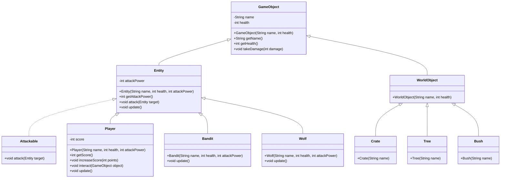

# **Fantasy Game Entities**

A Java program that demonstrates abstraction, inheritance, and interfaces, showcasing the creation of entities and world objects in a fantasy game setting, packaged as a Docker image.

**Abstraction, Inheritance, and Interfaces**
------------------------------------------

This program showcases the power of abstraction, inheritance, and interfaces in Java. It models a simple fantasy game world with various entities and world objects, highlighting key object-oriented programming principles.

**Entities and World Objects**
-----------------------------

The game world consists of two main types of components: entities and world objects. Entities are interactive objects that can perform actions, such as attacking and updating their state. World objects are passive objects that can be interacted with by entities but do not have the same level of interactivity.

**Usage**
-----

### Running the Docker Image

1. Ensure Docker is installed on your system.
2. Clone this repository and navigate to the project directory.
3. Run `docker-compose up` to build and start the container. This command will execute the `Main` class, which demonstrates the creation and interaction of various entities and world objects.

### Building the Docker Image Manually

1. Install Docker if you haven't already.
2. Clone the repository and navigate to the project directory.
3. Build the Docker image using `docker build -t fantasy-game-entities .`.
4. Start a container using the image with `docker run -it fantasy-game-entities`.

**Code Structure**
-----------------

- `game/`: Contains the main game package and its subpackages.
  - `entity/`: Package containing entity-related classes.
    - `Entity.java`: Abstract class representing an entity with health and attack power.
    - `Attackable.java`: Interface defining the ability to attack another entity.
    - `Player.java`, `Bandit.java`, `Wolf.java`: Concrete entity classes.
  - `worldobject/`: Package containing world object-related classes.
    - `WorldObject.java`: Abstract class representing a world object with health.
    - `Crate.java`, `Tree.java`, `Bush.java`: Concrete world object classes.
- `game/Main.java`: Main class demonstrating the creation and interaction of entities and world objects.
- `Dockerfile`: Dockerfile to build the Docker image.
- `docker-compose.yml`: Docker Compose file defining the service.

**Demonstration of Concepts**
---------------------------

- **Abstraction**: The `Entity` and `WorldObject` classes provide an abstract representation of game components, allowing for common behavior and properties while leaving specific implementations to concrete subclasses.
- **Inheritance**: The entity classes (`Player`, `Bandit`, `Wolf`) inherit from the `Entity` class, gaining its attributes and behaviors. Similarly, world object classes inherit from `WorldObject`.
- **Interfaces**: The `Attackable` interface defines a contract that entities must implement to have the ability to attack. This demonstrates the power of interfaces in defining behavior without specifying implementation details.

This project provides a basic foundation for understanding abstraction, inheritance, and interfaces in Java within the context of a simple fantasy game world.

**Classes Dependency Diagram**
---------------------------

